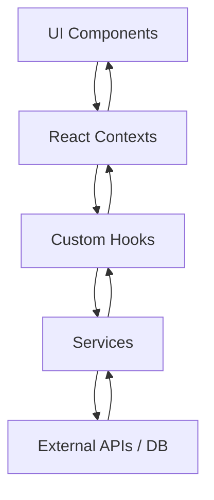
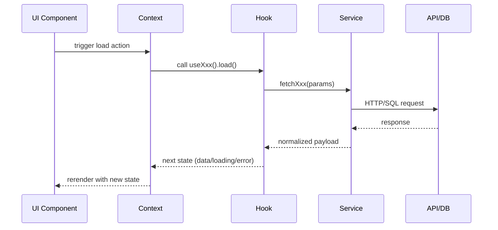
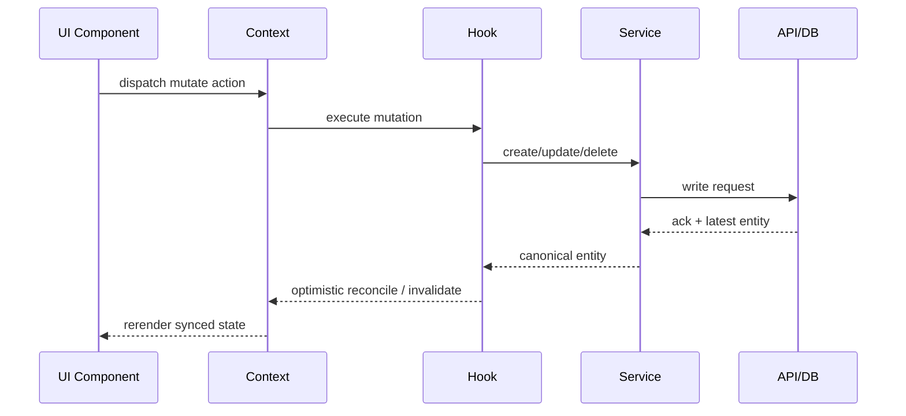

# Architecture Overview

## Layers
- **UI Components**: renders screens and dispatches interactions.
- **Contexts**: owns cross-feature state and exposes providers.
- **Hooks**: orchestrates side effects and domain use-cases.
- **Services**: handles API/database/3rd-party integrations.

## Data Flow: contexts ↔ hooks ↔ services

## Request Lifecycle (read)

## Request Lifecycle (write)

