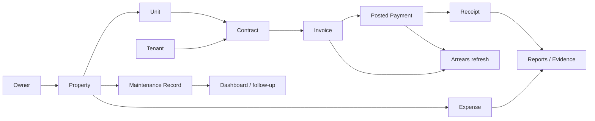

# Rentrix Final Product Blueprint

**Defines what Rentrix v1.0 is designed to become. It is not the execution roadmap.**

Execution authority stays in `docs/RENTRIX_MASTER_PLAN.md`.
Current execution status stays in `docs/ai/CURRENT_EXECUTION_CONTEXT.md`.
Final QA evidence stays in `docs/ai/FINAL_DELIVERY_GATE_QA_EVIDENCE.md`.

---

## 1. Product North Star

Rentrix is an **Arabic-first, mobile-first, single-office real estate operations system** for property offices that need to run daily work faster, collect payments with less confusion, produce professional documents, and see operational risk before it becomes a dispute.

The v1.0 product should feel like a practical office operating system, not a generic SaaS dashboard. It must help an office answer these questions quickly:

- What properties and units do we manage?
- Which units are occupied, vacant, or under maintenance?
- Which contracts are active, expiring, overdue, or risky?
- Who owes money, how much, and since when?
- Which invoice became which posted payment and which receipt?
- What can be printed or exported for a tenant, owner, or manager today?
- What changed, who changed it, and can we trust the data?

### Primary customer

Small and medium real-estate offices in Arabic-first markets, especially offices that manage multiple properties and units but do not need SaaS multi-tenancy, a general accounting ledger, or complex enterprise setup.

### Product promise

Rentrix should make a real office look more professional in front of tenants and owners, reduce lost payment evidence, and give the operator a clear next action every day.

---

## 2. Final v1.0 Application Map

The final Rentrix v1.0 application contains these module groups.

### Core Operations

- **Dashboard** — daily operational command center, KPI cards, risk alerts, quick actions.
- **Properties** — property inventory, ownership context, unit/expense/maintenance access.
- **Units** — occupancy, rent, unit status, linked contracts.
- **People** — shared contact/person registry.
- **Tenants** — tenant records linked to contracts and payments.
- **Owners** — owner records linked to properties.
- **Owners Hub** — owner-facing summaries without settlement or payout claims.
- **Contracts** — lease lifecycle: create, active, expiring, renewal, termination, status clarity.
- **Maintenance** — maintenance records tied to properties/units.

### Financial Operations

- **Financials / Payments** — payment recording hub.
- **Invoices** — rent invoices and payment state.
- **Receipts** — payment-backed receipts only.
- **Expenses** — property and office expense recording and export.
- **Arrears** — outstanding balance visibility and aging context.

### Reports & Evidence

- **Reports** — operational financial summaries and read-only statement areas.
- **Print / PDF / CSV outputs** — professional outputs only where implemented and verified.
- **Receipt browser print** — current receipt proof path until a dedicated receipt PDF is approved and implemented.
- **Audit and data-integrity evidence** — proof that operational data is traceable and trustworthy.

### Approved Growth Modules

- **Lands** — land and undeveloped property tracking.
- **Leads** — pipeline for property/tenant opportunities.
- **Commissions** — commission tracking/reporting only; no payroll or payout automation.
- **Communication** — internal communication log only; no external WhatsApp/SMS/email sending.

### Governance & Settings

- **Settings** — office profile, branding, numbering, notification preferences, print identity.
- **Change Password** — account security flow.
- **Audit Log** — authorized read-only audit visibility.
- **Data Integrity** — authorized validation and consistency visibility.
- **System Governance** — authorized operational controls and diagnostics.

---

## 3. Full Application Diagram

```mermaid
flowchart TB
  Rentrix["Rentrix v1.0<br/>Arabic-first • Mobile-first • Single-office"]

  Rentrix --> Core["Core Operations"]
  Rentrix --> Finance["Financial Operations"]
  Rentrix --> Evidence["Reports & Evidence"]
  Rentrix --> Growth["Approved Growth Modules"]
  Rentrix --> Governance["Governance & Settings"]

  Core --> Dashboard["Dashboard"]
  Core --> Properties["Properties"]
  Core --> Units["Units"]
  Core --> People["People"]
  Core --> Tenants["Tenants"]
  Core --> Owners["Owners"]
  Core --> OwnersHub["Owners Hub"]
  Core --> Contracts["Contracts"]
  Core --> Maintenance["Maintenance"]

  Finance --> Payments["Financials / Payments"]
  Finance --> Invoices["Invoices"]
  Finance --> Receipts["Receipts"]
  Finance --> Expenses["Expenses"]
  Finance --> Arrears["Arrears"]

  Evidence --> Reports["Reports"]
  Evidence --> Statements["Read-only summaries / statements"]
  Evidence --> PrintExport["Print / PDF / CSV evidence"]
  Evidence --> AuditEvidence["Audit / Data Integrity evidence"]

  Growth --> Lands["Lands"]
  Growth --> Leads["Leads"]
  Growth --> Commissions["Commissions"]
  Growth --> Communication["Internal Communication Log"]

  Governance --> Settings["Settings"]
  Governance --> ChangePassword["Change Password"]
  Governance --> AuditLog["Audit Log"]
  Governance --> DataIntegrity["Data Integrity"]
  Governance --> System["System Governance"]
```

---

## 4. Canonical Business Flow

### Non-negotiable domain rules

- A property owns units.
- A contract references one unit and one tenant.
- A payment belongs to one contract/invoice flow; standalone payments are not allowed.
- A receipt is generated only from a posted payment.
- Active contracts for the same unit must not overlap.
- Posted payments are immutable; corrections use reversal/replacement patterns.
- Outstanding balance is calculated, not manually edited.

---

## 5. Market Breakout Strategy

Rentrix can win by being the fastest and clearest Arabic-first operating system for a real-estate office. The goal is not to look like a large enterprise ERP; the goal is to make the daily operator faster and the office more trusted.

### 5.1 Day-one value

A first customer should see value in the first session:

- Add property and units.
- Add tenant/owner.
- Create contract.
- Generate invoice.
- Record payment.
- Print/share receipt evidence.
- See arrears and dashboard refresh.

This workflow is the product's commercial wedge. Every release must protect it.

### 5.2 Arabic-first advantage

- Native RTL layout, not translated LTR screens.
- Arabic financial labels that avoid accounting false claims.
- Office-friendly wording: collected, outstanding, arrears, expenses, receipt, contract.
- English/LTR remains safe for mixed offices, but Arabic is the lead experience.

### 5.3 Mobile-first operator advantage

- Cards on phone, tables on desktop.
- Clear touch targets.
- Bottom/drawer navigation that exposes real work, not hidden modules.
- Fast create/edit flows that work while the operator is away from the desk.
- Every page should answer: what happened, what is risky, what is the next action?

### 5.4 Trust and evidence advantage

- Payment-backed receipts.
- Print-ready documents where implemented.
- CSV exports that preserve Arabic compatibility.
- Audit log and data-integrity visibility.
- Clear blocked/unverified QA status before production claims.

### 5.5 Simplicity advantage

Rentrix intentionally avoids SaaS setup complexity:

- No organizations.
- No membership/invitation model.
- No subscription tiers in the product workflow.
- No general ledger UI.
- No owner payout automation.

That makes the first-client path simpler, cheaper, and faster to support.

### 5.6 Demo moments that should sell the product

The v1.0 demo should be built around these moments:

1. Dashboard opens in Arabic and immediately shows today's work.
2. The operator finds a unit and contract quickly.
3. A payment is recorded and the receipt appears with professional evidence.
4. Arrears and reports reflect the change.
5. The office can show owner/tenant summaries without pretending to be an accounting ledger.
6. The admin can see audit/data-integrity evidence when trust is questioned.

### 5.7 What “market-ready” means

Rentrix is market-ready only when the product is easy to explain, safe to operate, and proven through final delivery gates. It is not market-ready merely because repository checks pass.

---

## 6. Fixed Release Train to v1.0

This release train describes the intended path. If it conflicts with `docs/RENTRIX_MASTER_PLAN.md`, the master plan wins and this file must be updated.

### v0.5 — Commercial Hardening Preparation

- **Objective:** Prepare the product, docs, checklists, and runbooks for commercial readiness review.
- **Scope:** Repo-only planning, final QA evidence structure, operator checklist, support/runbook notes, status clarity, contradiction cleanup.
- **Not included:** App code changes, Supabase Cloud work, migrations, RLS changes, RPC changes, Vercel production changes, new features.
- **Exit criteria:** Docs clearly show blocked gates, current phase, product boundaries, and operator-run evidence needed for GO/NO-GO.

### v0.6 — UI Consistency and Mobile Polish

- **Objective:** Make all active pages feel like one coherent product.
- **Scope:** Consistent cards, tabs, dialogs, forms, empty states, mobile drawer/bottom navigation, RTL spacing, table/card parity, clear page purpose.
- **Not included:** New modules, ledger features, SaaS features, production DB changes.
- **Exit criteria:** Active pages pass a UI consistency checklist on mobile and desktop, with no hidden/dead approved modules.

### v0.7 — Reports, Statements, and Output Polish

- **Objective:** Make reports and office outputs useful, professional, and safe.
- **Scope:** Improve existing report clarity, CSV/print/PDF surfaces that are already implemented or explicitly approved, statement wording, export naming, Arabic compatibility, print guidance.
- **Not included:** Accounting-grade P&L, balance sheet, tax finality, owner settlement/payout documents, or unapproved dedicated receipt/report PDF work.
- **Exit criteria:** Operator can produce trustworthy outputs without any false accounting or settlement claim.

### v0.8 — Operator QA Readiness

- **Objective:** Freeze feature expansion and stabilize for real operator testing.
- **Scope:** Bug fixes only, error-state clarity, permission-state clarity, performance/route sanity, edge-case handling, known limitations.
- **Not included:** New feature lanes, major architecture changes, DB redesign, provider integrations.
- **Exit criteria:** Known QA checklist is complete enough for a live ADMIN session; unresolved risks are explicit.

### v0.9 — Final Delivery Gate Evidence

- **Objective:** Collect or record final delivery evidence for production GO/NO-GO.
- **Scope:** B-1/B-2/B-3/B-4 evidence, screenshots/recordings/operator notes where available, explicit UNVERIFIED entries where evidence cannot be collected.
- **Not included:** Feature additions or scope expansion during evidence collection.
- **Exit criteria:** Final status is explicitly GO, NO-GO, or BLOCKED with evidence.

### v1.0 — First Commercial Release

- **Objective:** Release the first customer-ready Rentrix version.
- **Scope:** Production handover, support notes, onboarding path, issue triage, bug-fix policy.
- **Not included:** New roadmap expansion after handover unless separately approved.
- **Exit criteria:** First operator can run the core chain in production and the support path is clear.

---

## 7. Final Delivery Gates

Production readiness cannot be claimed before these gates are complete or explicitly recorded as blocked/unverified.

### B-1: Authenticated ADMIN Browser QA

- Login with an ADMIN operator session.
- Verify protected routes and refresh behavior.
- Check Arabic RTL and English/LTR sanity.
- Verify dashboard, navigation, settings, reports, and core workflow access.

### B-2: Invoice → Payment → Receipt → Reports Refresh

- Start from a real or controlled invoice.
- Record payment through the approved workflow.
- Verify receipt generation.
- Verify invoice/payment status and reports/arrears refresh.
- Record evidence.

### B-3: Mobile / Physical-device Print QA

- Test receipt browser print and relevant document outputs on a physical device where possible.
- If not possible, record physical print as UNVERIFIED rather than claiming success.

### B-4: Live Allowed Writes and RLS Behavior

- Verify allowed writes under authenticated roles.
- Verify unauthorized roles fail safely.
- Confirm role/permission behavior with evidence.

---

## 8. Commercial Boundaries

### In scope for v1.0

- Single-office property operations.
- Arabic-first operational UI.
- Property/unit/tenant/owner/contract workflows.
- Invoice/payment/receipt/arrears workflows.
- Operational reports and safe summaries.
- Approved lands/leads/commissions/internal communication modules.
- Governance and evidence visibility.

### Out of scope unless separately approved

- Shared-database SaaS multi-tenancy.
- Organizations, memberships, invitations, subscriptions, or org-scoped runtime behavior.
- General accounting ledger.
- Accounting-grade P&L, balance sheet, tax finality, profit, net income, or GAAP/IFRS claims.
- Owner settlement or payout automation.
- Commission payroll automation.
- External WhatsApp/SMS/email sending.
- Production Supabase/Vercel changes without explicit approval and runbook evidence.

---

## 9. Page Experience Standard

Every active page should satisfy this product standard before v1.0:

- Clear Arabic title and purpose.
- Primary action visible when allowed.
- Search/filter/sort where operationally useful.
- Loading, empty, filtered-empty, permission-denied, write-failed, and retry states.
- Mobile card layout and desktop table/detail layout where appropriate.
- RTL-safe spacing and icons.
- Safe financial wording.
- No placeholder modules in approved navigation.
- No fake metrics.
- No unexplained dead actions.

---

## 10. Agent Maintenance Rules

Future Codex, Claude, or generic agents must follow these rules:

1. Do not invent new release lanes.
2. Do not create competing roadmap documents.
3. Treat `docs/RENTRIX_MASTER_PLAN.md` as the roadmap authority.
4. Treat this file as final product shape only.
5. Treat `QUICK_STATUS.md`, `docs/ROADMAP.md`, and `docs/INDEX.md` as navigation or summary aids only.
6. Update current status only when merged PRs or verified evidence change reality.
7. Keep one coherent PR per phase or bug fix.
8. Do not expand scope while final delivery gates are blocked.
9. Use active code and migrations to resolve factual disputes.
10. Report blockers honestly instead of weakening product boundaries.

---

## 11. Relationship to Other Documents

- `docs/RENTRIX_MASTER_PLAN.md` — roadmap authority, release gates, current execution model.
- `docs/ai/CURRENT_EXECUTION_CONTEXT.md` — immediate state, blockers, next repo-only work.
- `docs/ai/FINAL_DELIVERY_GATE_QA_EVIDENCE.md` — final QA evidence status.
- `docs/FINAL_PRODUCT_BLUEPRINT.md` — final product definition and commercial shape.
- `QUICK_STATUS.md` — short non-authoritative snapshot.
- `docs/ROADMAP.md` — navigation pointer only.
- `docs/INDEX.md` — documentation map only.

If a future agent is unsure what to build, use this file for product shape, then use `docs/RENTRIX_MASTER_PLAN.md` and `docs/ai/CURRENT_EXECUTION_CONTEXT.md` for the executable next step.
