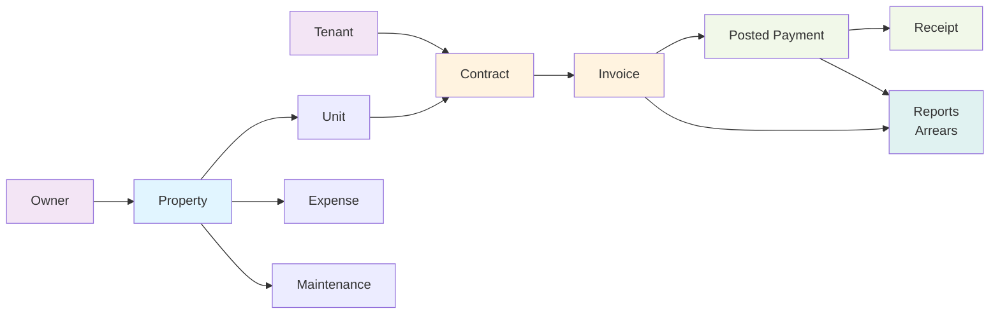

# Rentrix Final Product Blueprint

**What Rentrix is designed to become. Not the execution roadmap — see `docs/RENTRIX_MASTER_PLAN.md` for that.**

---

## A. Product North Star

Rentrix is an **Arabic-first, mobile-first, single-office real estate operations system** designed to help property offices manage daily operations with speed, clarity, trust, and professional output.

It is purpose-built for:
- Real estate agents and property managers in the Middle East and Gulf region
- Offices managing multiple properties and units
- Fast invoice → payment → receipt workflows
- Clear visibility into outstanding payments and arrears
- Professional PDF/CSV reporting without accounting-grade ledger claims
- Mobile-friendly office workflows with responsive design
- Daily dashboard visibility for operators
- Audit and data-integrity evidence for trust

It is **explicitly not**:
- A multi-tenant SaaS platform
- An accounting-grade general ledger
- An HR or payroll system
- A communication provider (WhatsApp, SMS, email)
- A settlement or payout automation system

---

## B. Final v1.0 Application Map

The complete Rentrix v1.0 application includes the following modules:

### Core Operations
- **Dashboard** — daily summaries, KPI cards, quick actions
- **Properties** — property inventory, details, units, owners
- **Units** — unit inventory, status, occupancy, rent
- **People** — global contact/person registry
- **Tenants** — tenant records linked to contracts
- **Owners** — owner records and property relationships
- **Owners Hub** — owner-specific summaries and statements

### Approved Growth Modules
- **Lands** — undeveloped property tracking
- **Leads** — potential tenant/property pipelines
- **Commissions** — agent/staff earnings tracking
- **Communication** — internal audit log of office communications

### Financial Operations
- **Contracts** — lease agreements with renewal/termination workflow
- **Financials / Payments** — core payment hub
- **Invoices** — rent invoicing
- **Receipts** — payment receipts (payment-backed)
- **Expenses** — property and office expenses
- **Arrears** — outstanding payment visibility
- **Reports** — financial summaries, owner statements, arrears reports

### Evidence & Governance
- **Maintenance** — property maintenance records and scheduling
- **Audit Log** — read-only audit trail of data changes
- **Data Integrity** — schema validation and constraint checks
- **Settings** — office configuration and preferences
- **System Governance** — role-based access and permissions
- **Change Password** — user credential management

---

## C. Full Application Mermaid Diagram

```mermaid
graph TB
  A["Rentrix v1.0<br/>Arabic-First Mobile-First<br/>Single-Office Real Estate"]
  
  A --> Core["Core Operations"]
  A --> Fin["Financial Operations"]
  A --> Reports["Reports & Evidence"]
  A --> Growth["Approved Growth"]
  A --> Gov["Governance & Settings"]
  
  Core --> C1["Dashboard"]
  Core --> C2["Properties"]
  Core --> C3["Units"]
  Core --> C4["People"]
  Core --> C5["Tenants"]
  Core --> C6["Owners<br/>Owners Hub"]
  
  Fin --> F1["Contracts"]
  Fin --> F2["Financials/Payments"]
  Fin --> F3["Invoices"]
  Fin --> F4["Receipts"]
  Fin --> F5["Expenses"]
  Fin --> F6["Arrears"]
  
  Reports --> R1["Reports"]
  Reports --> R2["Maintenance"]
  Reports --> R3["Audit Log<br/>Data Integrity"]
  
  Growth --> G1["Lands"]
  Growth --> G2["Leads"]
  Growth --> G3["Commissions"]
  Growth --> G4["Communication"]
  
  Gov --> S1["Settings"]
  Gov --> S2["System Governance"]
  Gov --> S3["Change Password"]
```

---

## D. Canonical Business Flow Diagram

---

## E. Market Explosion Plan

What makes Rentrix commercially strong:

### Language & Culture
- **Arabic-first design** — native RTL, Arabic UX conventions, cultural context
- **English/LTR functional** — not a second-class afterthought

### Mobile & Workflow
- **Mobile-friendly office workflows** — agents on property, on phone, in car
- **Responsive card-grid on mobile** — not just scaled-down desktop
- **Fast collection flow** — invoice → payment → receipt in minutes
- **Daily operator dashboard** — what matters most, right now

### Professional Output
- **Print-ready receipts** — office branding, QR codes, signature lines
- **PDF statements** — owner statements, tenant receipts
- **CSV exports** — integration with accounting offices, email distribution
- **Professional templates** — not generic SaaS styling

### Financial Visibility
- **Clear arrears visibility** — who owes, how much, how late
- **Owner/tenant summaries** — without accounting-grade claims
- **Payment confirmation** — receipt = trust
- **Audit trail** — who changed what, when

### Operational Trust
- **Safe financial wording** — "posted payment," "outstanding," not "profit," "net income," "balance sheet"
- **Single-office simplicity** — no subscription tiers, no org setup, no user invites
- **Practical onboarding** — 5-minute setup, clear next action per page
- **Evidence for regulators** — audit log, data integrity checks

### Competitive Edge
- **Real-estate-specific** — not a generic accounting tool
- **Operator-focused** — not accountant-focused
- **Fast & responsive** — not bloated SaaS UI
- **Trust-first design** — financial clarity over features

---

## F. Fixed Release Train to v1.0

Remaining major release objectives (verify against current `docs/RENTRIX_MASTER_PLAN.md` for any updates):

### v0.5: Commercial Hardening
- **Objective:** Prepare code, documentation, and runbooks for first commercial use
- **Scope:** RLS hardening, payment atomicity, audit readiness, runbook creation
- **Not included:** New modules, UI redesign, mobile-first rewrite
- **Exit:** All RLS grants verified, atomic RPCs tested, runbooks documented

### v0.6: UI Consistency & Mobile Polish
- **Objective:** Ensure UI is consistent and mobile-usable across all visible pages
- **Scope:** Responsive layouts, card grids, touch targets, RTL verification
- **Not included:** New pages, accounting features, SaaS organization
- **Exit:** Mobile manual QA pass, desktop consistency verified

### v0.7: Reports, Statements, Export Polish
- **Objective:** Solidify financial report output without accounting-grade claims
- **Scope:** Report formatting, PDF/CSV export, owner statements, arrears clarity
- **Not included:** General ledger, tax forms, profit calculations, settlement workflows
- **Exit:** Sample reports printed and verified, CSV import/export working

### v0.8: Operator QA Readiness
- **Objective:** Stabilize and bug-fix for live operator testing
- **Scope:** Bug fixes, performance tuning, missing error messages, edge case handling
- **Not included:** New features, architectural changes, data migration
- **Exit:** QA backlog zero, documented known limitations recorded

### v0.9: Final Delivery Gate Evidence
- **Objective:** Collect and verify final gates before GO/NO-GO
- **Scope:** B-1 (browser QA), B-2 (invoice flow), B-3 (mobile print), B-4 (live writes)
- **Not included:** Feature additions, customer customization
- **Exit:** All gates documented, GO/NO-GO decision made

### v1.0: First Commercial Release
- **Objective:** Release to first production customer
- **Scope:** Customer onboarding, live support, bug fixes
- **Not included:** New modules, architectural changes
- **Exit:** Customer running live, no critical blockers, support established

---

## G. Final Delivery Gates

These gates must be complete before production GO:

### B-1: Authenticated ADMIN Browser QA
- Verify logged-in ADMIN can use all visible pages
- Test core workflows: invoice → payment → receipt
- Verify Arabic RTL rendering and navigation
- Record evidence: screenshots, screen recordings, test notes

### B-2: Invoice → Payment → Receipt → Reports Refresh
- Create invoice → create payment → generate receipt
- Verify payment status updates contract
- Verify reports reflect changes
- Test with multiple properties, units, contracts
- Record evidence: output screenshots, report samples

### B-3: Mobile/Device Print QA or Explicit Unverified Recording
- If testing on physical device: print receipt to PDF, verify formatting
- If not tested: **explicitly record** "mobile print verification pending live test"
- Do not claim "mobile print verified" if untested
- Record evidence or explicit unverified status

### B-4: Live Database Writes and RLS Behavior
- Verify authenticated users can POST/PATCH/DELETE
- Verify RLS prevents unauthorized access
- Verify role claims prevent unprivileged writes
- Test with multiple roles (ADMIN, MANAGER, USER)
- Record evidence: mutation results, RLS logs, role verification

**Production readiness CANNOT be claimed until all gates are complete and documented.**

---

## H. Out-of-Scope Boundaries

The following are explicitly NOT part of Rentrix and must not be added without separate approval:

### Organization & Multi-Tenancy
- ❌ Multiple organizations per database
- ❌ Memberships, invitations, or subscriptions
- ❌ Organization-scoped data isolation
- ✅ Single office, single ownership model

### Accounting
- ❌ General ledger with GL accounts and journals
- ❌ Double-entry bookkeeping automation
- ❌ Accounting-grade P&L, balance sheet, or tax finality
- ❌ Profit, net income, or GAAP compliance claims
- ✅ Invoice-based operational summary only

### Settlement & Payout
- ❌ Owner settlement or payout automation
- ❌ Commission payroll calculation
- ❌ Tax withholding or deduction logic
- ✅ Commission tracking and reporting only (manual settlement by office)

### External Communication
- ❌ WhatsApp, SMS, or email sending to tenants/owners
- ❌ Notification delivery integration
- ❌ Automated message templates
- ✅ Internal office communication log only (audit trail)

### Production Changes Without Approval
- ❌ Supabase schema mutations without reviewed migration
- ❌ RLS policy changes without security review
- ❌ RPC or SECURITY DEFINER function changes without testing
- ❌ Vercel deployment changes without staging verification
- ❌ Environment variable or configuration changes without runbook

---

## I. Agent Instructions for Maintaining This Blueprint

**For Codex and Claude agents:**

1. **Do not invent new phases.** If you see a need for a new release phase, document the rationale in the PR body and update `docs/RENTRIX_MASTER_PLAN.md` with explicit approval reasoning.

2. **Do not create competing roadmap documents.** Only `docs/RENTRIX_MASTER_PLAN.md` may claim roadmap authority. Use this blueprint to describe what you're building toward, not to claim execution authority.

3. **Do not treat quick summaries as authoritative.** `QUICK_STATUS.md`, `docs/ROADMAP.md`, and other pointers are navigation aids. They must link to `docs/RENTRIX_MASTER_PLAN.md` and `docs/ai/CURRENT_EXECUTION_CONTEXT.md` for authoritative status.

4. **Update status only when merged PRs or verified evidence change reality.** Do not speculate about future phases or assume completion.

5. **Use active code and current docs as source of truth.** If a doc claims X but the code does Y, inspect the code, update the doc, and explain the mismatch in the PR.

6. **Keep one coherent PR per phase.** Do not fragment a release phase across 10 scattered PRs. Use feature branches that represent complete work.

7. **Preserve out-of-scope boundaries.** If a feature request conflicts with section H, document why it conflicts and raise the issue for explicit approval before implementing.

---

## Relationship to Other Documents

- **`docs/RENTRIX_MASTER_PLAN.md`** — defines HOW to release, what gates exist, current execution baseline
- **`docs/ai/CURRENT_EXECUTION_CONTEXT.md`** — defines what is BLOCKED RIGHT NOW and what to work on next
- **`docs/FINAL_PRODUCT_BLUEPRINT.md`** (this file) — defines WHAT the final product looks like
- **`QUICK_STATUS.md`** — quick summary for new agents (points to the above three)
- **`docs/ROADMAP.md`** — navigation guide only (points to the above three)

If you are confused about what to build, read this file.
If you are confused about when to release, read `docs/RENTRIX_MASTER_PLAN.md`.
If you are confused about what to work on RIGHT NOW, read `docs/ai/CURRENT_EXECUTION_CONTEXT.md`.

---

**Last updated:** June 18, 2026 | **Authority:** Product definition document (not execution) | **Next review:** After each major phase closure
