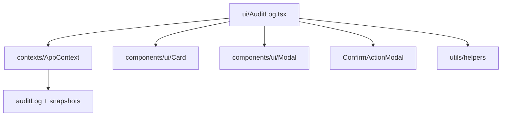

# 05 - Dependency Graphs

Legend: `REUSE_CURRENT` = use current runtime file/service; `PORT` = direct current-style port is reasonable; `ADAPT` = rewrite behind adapters; `REFERENCE_ONLY` = behavior reference; `DISCARD` = do not use; `BLOCKED` = wait for schema/permission/security verification.

## AuditLog

| Dependency | Status | Notes |
| --- | --- | --- |
| `ui/AuditLog.tsx` | ADAPT | Port read-only list/filter behavior; remove snapshot create/restore controls first. |
| `useApp`/`AppContext` | DISCARD | Deprecated architecture. |
| `db.auditLog` | ADAPT | Replace with typed Supabase list service after table verification. |
| `db.snapshots`, `createSnapshot`, `restoreBackup` | BLOCKED | Backup/restore is privileged and not needed for pilot. |
| `Card`, `Modal`, `ConfirmActionModal` | REUSE_CURRENT/PORT | Prefer current card/dialog; port confirm only if needed later. |

## DataIntegrityAudit

| Dependency | Status | Notes |
| --- | --- | --- |
| `ui/DataIntegrityAudit.tsx` | ADAPT | Admin read-only issue display can be ported later. |
| `runDataIntegrityAudit` | ADAPT | Convert from in-memory `db` scan to typed service inputs. |
| `migrateAttachments` | BLOCKED | Repair/migration action must stay disabled until explicit approval. |
| `react-router-dom Link` | DISCARD | Replace with TanStack `Link`. |
| `auth.currentUser.role === ADMIN` | ADAPT | Use current permission mapping. |
| Tables | BLOCKED | Assumes broad table coverage and attachments. |

## ChangePassword

| Dependency | Status | Notes |
| --- | --- | --- |
| `ui/ChangePassword.tsx` | ADAPT | Small form can be rewritten. |
| `auth.changePassword` from `useApp` | ADAPT | Use current auth provider/Supabase auth mutation. |
| Forced `mustChange` route | ADAPT | Add TanStack route/guard only if current auth exposes equivalent state. |

## OwnersHub

| Dependency | Status | Notes |
| --- | --- | --- |
| `ui/OwnersHub.tsx` | ADAPT | Good read-only owner aggregate after audit pilot. |
| React Router `useParams` | DISCARD | Replace with TanStack params. |
| `db.owners/properties/units/contracts/invoices/receipts/expenses` | ADAPT | Replace with current services or one aggregate query. |
| `financeService` helpers | MERGE | Extract pure calculations where current financial helpers lack equivalents. |
| Permission | ADAPT | Authenticated internal route. |

## OwnerView

| Dependency | Status | Notes |
| --- | --- | --- |
| `ui/OwnerView.tsx` | ADAPT | Portal route useful but security-sensitive. |
| `useParams`, `useSearchParams` | DISCARD | Replace with TanStack params/search. |
| `verifyOwnerAccessToken` | BLOCKED | Verify edge function contract and token exposure. |
| `OwnerPortalPayload` | ADAPT | Type response locally with current Supabase client. |

## Lands

| Dependency | Status | Notes |
| --- | --- | --- |
| `ui/Lands.tsx` | ADAPT | Port read-only first; defer mutations. |
| `dataService.add/update/remove('lands')` | BLOCKED | Requires `lands` table/schema verification. |
| Journal entry side effects | BLOCKED | Do not start with financial writes. |
| `NumberInput`, `ActionsMenu` | PORT | Small UI dependencies can be adapted when needed. |

## Leads

| Dependency | Status | Notes |
| --- | --- | --- |
| `ui/Leads.tsx` | ADAPT | Useful CRM CRUD after demo core. |
| `db.leads`, `dataService` | ADAPT | Replace with feature-local service after table verification. |
| `WhatsAppComposerModal` | REFERENCE_ONLY | Port only after communication policy review. |

## Commissions

| Dependency | Status | Notes |
| --- | --- | --- |
| `ui/Commissions.tsx` | ADAPT | Read-only list first. |
| `financeService.payoutCommission` | BLOCKED | Financial write/payout must be separately approved and tested. |
| `db.commissions`, `db.auth.users` | BLOCKED | Schema/permissions unknown. |

## CommunicationHub

| Dependency | Status | Notes |
| --- | --- | --- |
| `ui/CommunicationHub.tsx` | ADAPT | Port after notifications schema check. |
| `generateNotifications` | BLOCKED | Side-effectful generation needs explicit workflow design. |
| `outgoingNotifications` | ADAPT | Read/update statuses after table verification. |
| `WORKFLOW_STATUS` | MERGE | Normalize status constants if current needs them. |

## SmartAssistant

| Dependency | Status | Notes |
| --- | --- | --- |
| `ui/SmartAssistant.tsx` | REFERENCE_ONLY | Thin wrapper around shared historical assistant. |
| `components/shared/SmartAssistant.tsx` | REFERENCE_ONLY | Review UX only. |
| `geminiService.ts` | BLOCKED | AI key/data exposure risk; reimplement against current architecture. |

## Finance

| Dependency | Status | Notes |
| --- | --- | --- |
| `ui/Finance.tsx` | DISCARD | Old nested React Router shell. |
| `Invoices`, `Financials`, `GeneralLedger`, `Accounting`, `Arrears` | MERGE/ADAPT | Port subfeatures individually, not the shell. |
| `useApp` stale data state | DISCARD | Current Query state should drive diagnostics. |

## Financials

| Dependency | Status | Notes |
| --- | --- | --- |
| `ui/Financials.tsx` | MERGE | Use as UX/workflow reference. |
| `Receipt`, `Expense`, `DepositTx`, `OwnerSettlement` | ADAPT | Current financial DTOs differ. |
| `dataService` writes | BLOCKED | Defer advanced financial writes. |

## Invoices

| Dependency | Status | Notes |
| --- | --- | --- |
| `ui/Invoices.tsx` | MERGE | Current invoice page exists; selectively adapt richer UI. |
| `InvoiceFilters`, `InvoiceTable`, `QuickPayModal` | MERGE | Map props to current DTOs and tested payment service. |
| `receiptService` | MERGE | Current receipt/payment tests should remain source of truth. |
| React Router `useLocation` | DISCARD | Replace with TanStack search. |

## Accounting

| Dependency | Status | Notes |
| --- | --- | --- |
| `ui/Accounting.tsx` | ADAPT | Current page is placeholder; old has real content. |
| `db.accounts`, `db.accountBalances`, `db.journalEntries` | BLOCKED | Verify schema first. |
| `ManualVoucherForm` | BLOCKED | Defer writes. |
| `exportTrialBalanceToPdf` | REFERENCE_ONLY | Port after read-only accounting succeeds. |

## GeneralLedger

| Dependency | Status | Notes |
| --- | --- | --- |
| `ui/GeneralLedger.tsx` | ADAPT | Read-only ledger is useful later. |
| `calculateGeneralLedgerForAccount` | MERGE | Extract pure calculation if tests can cover it. |
| `ManualVoucherForm` | BLOCKED | Defer voucher writes. |
| Source lookup across receipts/expenses/invoices | ADAPT | Use current typed services/joins. |

## Explicitly flagged deprecated dependencies

| Dependency/risk | Features affected |
| --- | --- |
| `AppContext` / `useApp` | AuditLog, DataIntegrityAudit, ChangePassword, OwnersHub, Lands, Leads, Commissions, CommunicationHub, Finance, Financials, Invoices, Accounting, GeneralLedger, settings/print layout. |
| React Router | DataIntegrityAudit, OwnersHub, OwnerView, Finance, Invoices, Accounting, print sidebar/notifications. |
| Legacy Supabase/env hard throws | Historical `config/env.ts`, old Supabase service wrappers. |
| Privileged endpoints/admin RPCs | Owner portal edge functions, data integrity repair, audit snapshots, smart assistant, financial payout/write flows. |
| Mock/in-memory data assumptions | Historical `db.*`, `dataService`, old tests, context facades. |

